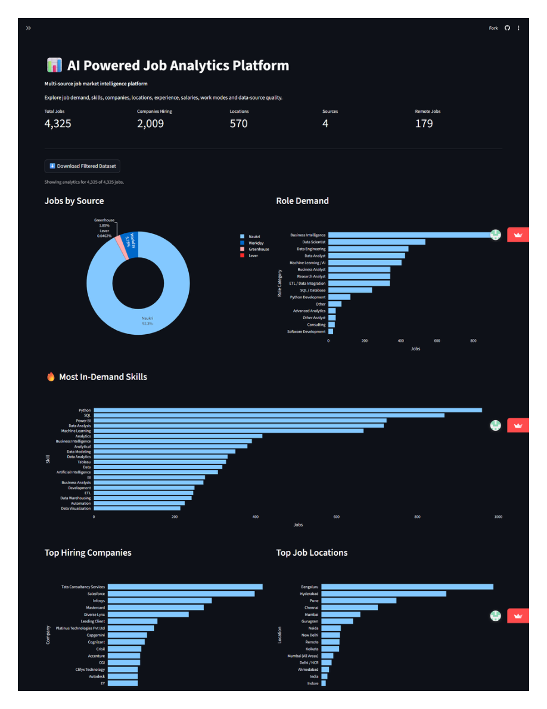
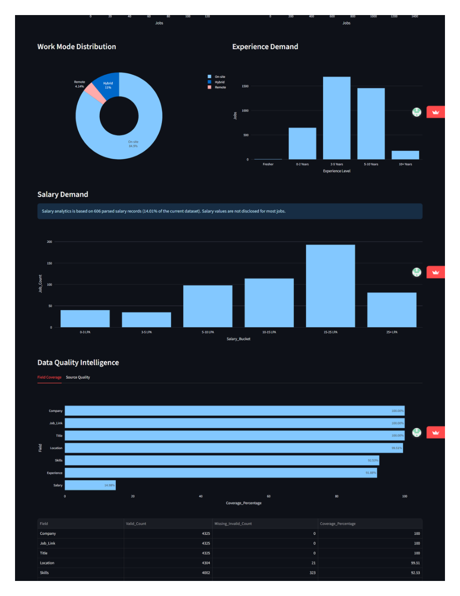
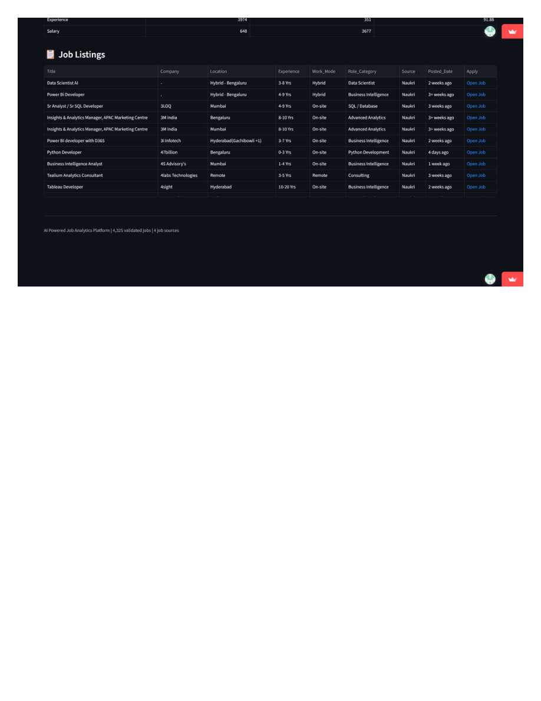

# 🤖 AI-Powered Job Analytics Platform

### From Job Collection → Data Engineering → Data Quality → Analytics → Visualization

A production-style **end-to-end job-market analytics platform** that collects job listings from multiple recruitment and ATS sources, engineers and validates the dataset, protects production data through quality gates, and converts the resulting data into interactive hiring-market analytics.

<p align="center">

**📊 4,325 Validated Jobs**   •  
**🏢 2,009 Companies**   •  
**📍 570 Locations**   •  
**🌐 4 Sources**

</p>

<p align="center">

<a href="https://naukri-job-analytics-platform-fyyympr7t2vqc2sg4snwzf.streamlit.app/">

</a>

<a href="https://github.com/prabath1509/naukri-job-analytics-platform">

</a>

</p>

---

# 📊 Dashboard Preview

The platform turns the collected job data into an interactive analytics dashboard covering hiring demand, skills, companies, locations, experience, work modes, salary availability, data quality, and individual job listings.

## 01 — Hiring Market Overview



The overview page provides:

* Total jobs
* Companies hiring
* Job locations
* Data sources
* Remote jobs
* Jobs by source
* Role demand
* Most in-demand skills
* Top hiring companies
* Top job locations

---

## 02 — Experience, Salary & Data Quality



The analytics layer covers:

* Work-mode distribution
* Experience demand
* Salary availability
* Salary buckets
* Field completeness
* Missing/invalid values
* Data-quality coverage

> **Salary note:** Salary analysis is based on the available parsed salary records rather than the complete dataset.

---

## 03 — Job Explorer



The Job Explorer provides searchable job-level information including:

* Job title
* Company
* Location
* Experience
* Work mode
* Role category
* Source
* Posted date
* Direct application link

---

# 🧭 Project Overview

Finding meaningful job-market insights requires more than collecting job listings or building a dashboard.

Job data is distributed across different recruitment platforms and company ATS systems. Each source can expose different fields, formats, structures, and levels of completeness.

This project builds a complete pipeline that transforms raw job listings into validated analytical data.

```text
🌐 DATA SOURCES
       ↓
🕷️ JOB COLLECTION
       ↓
🧹 CLEANING
       ↓
⚙️ TRANSFORMATION
       ↓
🔗 DEDUPLICATION
       ↓
🧪 VALIDATION
       ↓
🛡️ PUBLICATION QUALITY GATE
       ↓
🗄️ DATABASE
       ↓
📊 ANALYTICS
       ↓
🚀 STREAMLIT DASHBOARD
```

The project is designed as an **analytics engineering workflow**, not simply as a visualization project.

---

# 🎯 Problem Statement

Job-market information is fragmented across recruitment websites and Applicant Tracking Systems.

Common problems include:

* Inconsistent job-title formats
* Missing salary information
* Different experience formats
* Inconsistent location values
* Duplicate job listings
* Different work-mode terminology
* Source-specific data structures
* Changing website layouts
* Different levels of field completeness

Without a proper data pipeline, these issues can produce unreliable analytics.

This project addresses the problem by creating a repeatable workflow for:

**Collection → Cleaning → Transformation → Validation → Storage → Analytics → Visualization**

---

# 💼 Business Questions

The platform is designed to answer questions such as:

### Hiring Demand

* Which companies are hiring the most?
* Which locations have the highest job demand?
* Which roles have the highest representation?

### Skills

* Which technical skills appear most frequently?
* What skills are associated with analytics and technology roles?

### Experience

* What experience levels are most frequently requested?
* How is demand distributed across experience categories?

### Work Mode

* What proportion of available jobs are on-site?
* How much of the dataset represents hybrid or remote work?

### Salary

* How much salary information is available?
* What salary ranges appear within the records where salary is disclosed?

### Data Quality

* How complete are the important analytical fields?
* Which sources contribute the most records?
* Are duplicate job links present?
* Should a new dataset be allowed to replace the current production dataset?

---

# 🏗️ System Architecture

```text
                         JOB SOURCES
                              │
        ┌─────────────────────┼─────────────────────┐
        │          │          │          │           │
      Naukri   Greenhouse  Workday    Lever   SmartRecruiters
        │          │          │          │           │
        └─────────────────────┼─────────────────────┘
                              │
                              ▼
                    WEB SCRAPERS / COLLECTION
                              │
                              ▼
                   CLEANING & STANDARDIZATION
                              │
                              ▼
                         ENRICHMENT
                              │
             ┌────────────────┼────────────────┐
             │                │                │
             ▼                ▼                ▼
        Experience         Salary           Skills
         Parsing           Parsing         Processing
             │                │                │
             └────────────────┼────────────────┘
                              │
                              ▼
                       DEDUPLICATION
                              │
                              ▼
                        VALIDATION
                              │
                              ▼
                  PUBLICATION QUALITY GATE
                         │          │
                       PASS        FAIL
                         │          │
                         ▼          ▼
                   Production   Preserve Previous
                    Dataset      Validated Dataset
                         │
                         ▼
                   SQLITE DATABASE
                         │
              ┌──────────┴──────────┐
              │                     │
              ▼                     ▼
       ANALYTICS OUTPUTS       QUALITY METRICS
              │                     │
              └──────────┬──────────┘
                         ▼
                 STREAMLIT DASHBOARD
```

---

# 📥 Data Sources

The platform supports multiple recruitment and ATS sources.

| Source          | Collection Technology | Role                        |
| --------------- | --------------------- | --------------------------- |
| Naukri          | Selenium              | Recruitment-market listings |
| Greenhouse      | ATS collection        | Company ATS listings        |
| Workday         | ATS collection        | Enterprise hiring data      |
| Lever           | ATS collection        | Company job listings        |
| SmartRecruiters | ATS collection        | Company hiring data         |

The availability and field coverage of each source can vary between runs because external systems can change.

---

# ⚙️ ETL Pipeline

## 1️⃣ Extract

The collection layer gathers job records from supported sources.

Typical fields include:

```text
Job Title
Company
Location
Experience
Salary
Skills
Job URL
Source
Work Mode
Role Category
Posted Date
```

The main orchestration is handled by:

```text
main.py
```

Source-specific scrapers are maintained inside:

```text
scraper/
```

---

## 2️⃣ Transform

Raw records are transformed into a standardized structure.

Transformation includes:

* Text normalization
* Job-title cleaning
* Company normalization
* Location cleaning
* Experience parsing
* Salary parsing
* Skill processing
* Work-mode normalization
* Role/category classification
* Source normalization

---

## 3️⃣ Load

Validated records are stored in the project's database/data layer and transformed into analytical outputs consumed by the dashboard.

---

# 🧹 Cleaning & Transformation

The pipeline handles common job-market data-quality problems.

### Text Cleaning

* Removes unnecessary whitespace
* Standardizes text values
* Normalizes inconsistent representations

### Experience Parsing

Different experience formats are converted into analytical categories.

### Salary Parsing

Available salary information is extracted and organized into usable salary buckets.

### Skills Processing

Skill information is transformed into an analytical structure suitable for demand analysis.

### Work Mode

Different representations are standardized into categories such as:

* On-site
* Hybrid
* Remote

### Role Classification

Job titles are mapped into broader role categories for demand analysis.

---

# 🔗 Validation & Deduplication

Data quality is treated as a **core part of the pipeline**.

The project performs:

* Required-field validation
* Job-count validation
* Source-count validation
* Duplicate job-link detection
* Dataset integrity checks
* Field completeness analysis
* Source quality analysis
* Snapshot validation

---

# 🛡️ Publication Quality Gate

One of the key engineering features of the project is the **Publication Quality Gate**.

A scraper completing successfully does not automatically mean that the resulting dataset should be published.

The current production defaults require:

```text
Minimum Jobs    = 2,000
Minimum Sources = 3
```

The pipeline checks whether the new dataset meets the configured quality requirements.

```text
NEW SCRAPING RUN
       │
       ▼
DATA VALIDATION
       │
       ▼
QUALITY GATE
       │
   ┌───┴───┐
   │       │
 PASS     FAIL
   │       │
   ▼       ▼
PUBLISH   PRESERVE
   │      PREVIOUS
   ▼      DATASET
PRODUCTION
```

This protects the dashboard from being replaced by a degraded scraping run.

### Why this matters

The system distinguishes between:

```text
Scraper Execution Success
```

and:

```text
Production Data Publication Success
```

This is an important production-data engineering principle.

---

# 🗄️ Database

SQLite is used as the project's lightweight analytical storage layer.

The database supports:

* Persistent validated job data
* Structured querying
* Production dataset management
* Analytics generation
* Snapshot handling
* Dashboard data access

Using a database layer allows the project to move beyond a standalone notebook workflow.

---

# 📊 Analytics Layer

The validated dataset is transformed into business-facing metrics.

The dashboard analyzes:

### Hiring

* Company demand
* Location demand
* Role demand
* Source distribution

### Skills

* Most in-demand skills
* Skill frequency

### Experience

* Experience-level demand
* Experience distribution

### Work Mode

* On-site
* Hybrid
* Remote

### Salary

* Salary availability
* Salary buckets

### Data Quality

* Field coverage
* Missing values
* Source quality
* Validation metrics

---

# 📈 Key Results

The latest validated production snapshot contains:

| KPI               |    Result |
| ----------------- | --------: |
| 📊 Validated Jobs | **4,325** |
| 🏢 Companies      | **2,009** |
| 📍 Locations      |   **570** |
| 🌐 Sources        |     **4** |
| 🏠 Remote Jobs    |   **179** |

---

# 🧪 Data Quality Results

The latest dashboard shows the following field coverage:

| Field         |   Coverage |
| ------------- | ---------: |
| 🏢 Company    |   **100%** |
| 🔗 Job Link   |   **100%** |
| 📝 Title      |   **100%** |
| 📍 Location   | **99.51%** |
| 🧠 Skills     | **92.53%** |
| 💼 Experience | **91.88%** |
| 💰 Salary     | **14.98%** |

The dashboard's Data Quality Intelligence section also exposes valid and missing/invalid record counts for these fields.

---

# 💰 Salary Data

Salary information has substantially lower coverage than the core job fields.

The dashboard indicates that salary analysis is based on **606 parsed salary records**, representing approximately **14.01% of the current dataset**.

Therefore, salary charts should be interpreted as analysis of the available disclosed salary records rather than a complete representation of the overall job market.

---

# 🔎 Job Explorer

The dashboard provides job-level exploration.

Users can inspect:

| Field         | Example               |
| ------------- | --------------------- |
| Title         | Data Scientist AI     |
| Company       | Company name          |
| Location      | Bengaluru             |
| Experience    | 3–8 Yrs               |
| Work Mode     | Hybrid                |
| Role Category | Data Scientist        |
| Source        | Naukri                |
| Posted Date   | Relative posting date |
| Apply         | Direct job link       |

This connects the high-level analytics layer to individual job opportunities.

---

# 🔄 Automation

GitHub Actions is used for recurring pipeline execution.

The automated workflow can:

```text
Scheduled Run
     ↓
Scrape Sources
     ↓
Collect Data
     ↓
Clean & Transform
     ↓
Validate
     ↓
Quality Gate
     ↓
 ┌───┴────┐
 PASS     FAIL
 ↓         ↓
Publish   Preserve
 ↓        Previous
Update    Dataset
Analytics
```

This allows the project to maintain a validated production dataset while reducing the risk of publishing incomplete scraping results.

---

# ⚠️ Limitations

## External Website Changes

Web scraping depends on external page structures, which can change over time.

## Anti-Bot / Access Controls

Automated collection can encounter access restrictions or different behavior depending on the execution environment.

## Different ATS Structures

Recruitment and ATS platforms expose different fields and formats.

## Salary Availability

Salary information is not available for every job and therefore has substantially lower coverage.

## Snapshot-Based Dataset

The dataset represents collected snapshots and should not be interpreted as the complete job market.

## Duplicate Listings

The same vacancy can appear across multiple sources, requiring deduplication.

## Execution Environment

Local browser execution and GitHub-hosted automation can experience different access conditions.

---

# 🧰 Tech Stack

| Category           | Technology                        |
| ------------------ | --------------------------------- |
| 🐍 Programming     | Python                            |
| 📊 Data Analysis   | Pandas, NumPy                     |
| 🕷️ Web Scraping   | Selenium, Requests, BeautifulSoup |
| 🌐 HTML Parsing    | lxml                              |
| 🗄️ Database       | SQLite                            |
| 📈 Visualization   | Plotly                            |
| 🖥️ Dashboard      | Streamlit                         |
| ⚙️ Automation      | GitHub Actions                    |
| 🔧 Version Control | Git                               |
| ☁️ Deployment      | Streamlit Community Cloud         |

---

# 📂 Repository Structure

```text
naukri-job-analytics-platform/
│
├── dashboard/
│   └── app.py
│
├── scraper/
│   ├── naukri_scraper.py
│   ├── greenhouse_scraper.py
│   ├── workday_scraper.py
│   ├── lever_scraper.py
│   ├── smartrecruiters_scraper.py
│   └── ats_source_registry.py
│
├── data/
│
├── database/
│
├── analytics/
│
├── notebooks/
│
├── resume_matcher/
│
├── .github/
│   └── workflows/
│
├── scheduler.py
├── main.py
├── requirements.txt
└── README.mdtree
```

---

# 🚀 Installation

Clone the repository:

```bash
git clone https://github.com/prabath1509/naukri-job-analytics-platform.git

cd naukri-job-analytics-platform
```

Create a virtual environment:

```bash
python -m venv venv
```

Activate it on Windows:

```bash
venv\Scripts\activate
```

Install dependencies:

```bash
pip install -r requirements.txt
```

---

# ▶️ Running the Project

Run the pipeline:

```bash
python main.py
```

Launch the dashboard:

```bash
streamlit run dashboard/app.py
```

---

# 🔬 End-to-End Data Flow

```text
                 RAW JOB DATA
                      │
                      ▼
               DATA COLLECTION
                      │
                      ▼
                  CLEANING
                      │
                      ▼
               STANDARDIZATION
                      │
                      ▼
                 ENRICHMENT
                      │
                      ▼
               DEDUPLICATION
                      │
                      ▼
                 VALIDATION
                      │
                      ▼
              QUALITY GATE
                      │
                      ▼
                  DATABASE
                      │
                      ▼
                 ANALYTICS
                      │
                      ▼
                DASHBOARD
```

---

# 💡 Why This Project Is Different

Many analytics portfolios begin with an already-clean CSV and finish with a dashboard.

This project covers the stages before the dashboard.

```text
🌐 DATA COLLECTION
        ↓
🧹 DATA CLEANING
        ↓
⚙️ DATA ENGINEERING
        ↓
🔗 DEDUPLICATION
        ↓
🧪 DATA QUALITY
        ↓
🛡️ PRODUCTION VALIDATION
        ↓
🗄️ DATA STORAGE
        ↓
📊 ANALYTICS
        ↓
📈 VISUALIZATION
        ↓
⚙️ AUTOMATION
```

The project therefore demonstrates an end-to-end analytics workflow:

### Data Collection

Collecting job-market information from multiple external sources.

### Data Engineering

Cleaning, standardizing, enriching, and deduplicating raw records.

### Data Quality

Measuring field completeness and validating whether data is suitable for publication.

### Production Protection

Preventing a degraded scraping run from replacing the previous validated dataset.

### Analytics

Transforming validated job records into business-facing metrics.

### Visualization

Presenting hiring-market information through an interactive dashboard.

### Automation

Running recurring data collection and validation using GitHub Actions.

---

# 🎓 Portfolio Skills Demonstrated

This project demonstrates practical experience with:

```text
Python
Pandas
NumPy
SQL / SQLite
Selenium
Web Scraping
ETL
Data Cleaning
Data Transformation
Data Validation
Data Quality
Deduplication
Data Analysis
Plotly
Streamlit
Git
GitHub
GitHub Actions
Automation
```

---

# 📌 Project Highlights

* ✅ Multi-source job collection
* ✅ Automated ETL pipeline
* ✅ Data cleaning and standardization
* ✅ Experience parsing
* ✅ Salary parsing
* ✅ Skills processing
* ✅ Duplicate detection
* ✅ Data-quality measurement
* ✅ Publication quality gate
* ✅ Production dataset protection
* ✅ SQLite storage
* ✅ Interactive Streamlit dashboard
* ✅ Job Explorer
* ✅ Automated GitHub Actions workflow
* ✅ Snapshot-based production protection
* ✅ Multi-source analytics

---

# 🌐 Live Project

### 🚀 Live Dashboard

https://naukri-job-analytics-platform-fyyympr7t2vqc2sg4snwzf.streamlit.app/

### 💻 GitHub Repository

https://github.com/prabath1509/naukri-job-analytics-platform

---

# 👨‍💻 Author

## Krishna Prabath

**Aspiring Data Analyst | Python | SQL | Power BI | Data Visualization | Web Scraping**

### GitHub

https://github.com/prabath1509

### LinkedIn

https://www.linkedin.com/in/srinadhukrishnaprabath

### Portfolio

https://prabath1509.github.io/portfolio/

---

# ⭐ Project

If you find this project useful, consider giving the repository a star.

**Built to demonstrate an end-to-end journey from raw job-market data to validated analytics and interactive insights.**

# 🕷️ Scraper Usage

The scraper layer is responsible for collecting raw job listings from the supported recruitment and ATS sources before the records enter the ETL and validation pipeline.

## 📁 Scraper Modules

Source-specific scrapers are maintained inside the `scraper/` directory:

```text
scraper/
├── naukri_scraper.py
├── greenhouse_scraper.py
├── workday_scraper.py
├── lever_scraper.py
├── smartrecruiters_scraper.py
└── ats_source_registry.py
```

Each scraper is responsible for collecting job records using the structure appropriate to its source.

---

## 🚀 Run the Complete Scraping Pipeline

The recommended way to run the complete project pipeline is:

```bash
python main.py
```

The main orchestration layer coordinates the configured job sources and sends the collected records through the downstream processing pipeline.

```text
main.py
   │
   ├── Naukri
   ├── Greenhouse
   ├── Workday
   ├── Lever
   └── SmartRecruiters
          │
          ▼
     Raw Job Records
          │
          ▼
      ETL Pipeline
          │
          ▼
   Validation & Quality Gate
          │
          ▼
     Production Dataset
```

---

## 🔎 Naukri Scraper

The Naukri scraper uses Selenium to load search-result pages and extract job listings.

The scraper accepts a job-search keyword and number of pages.

Example:

```python
from scraper.naukri_scraper import scrape_naukri_jobs

jobs = scrape_naukri_jobs(
    "data-analyst",
    pages=1
)

print("TOTAL JOBS:", len(jobs))
```

A successful one-page local run currently returns the job records collected from the requested search page.

For example:

```text
TOTAL JOBS: 20
```

The scraper uses the current Naukri search-result structure and validates the returned page before processing it.

---

## 🔁 Naukri Pagination

The scraper generates the search URL according to the requested page.

For the first page:

```text
https://www.naukri.com/data-analyst-jobs
```

For subsequent pages:

```text
https://www.naukri.com/data-analyst-jobs-2
https://www.naukri.com/data-analyst-jobs-3
...
```

This avoids treating the first search page as a numbered page.

---

## 🛡️ Scraper Reliability Checks

The Naukri scraper includes checks to detect blocked or incomplete responses.

Before processing a page, the scraper validates information such as:

* Page title
* Page HTML length
* Current URL
* Job-card elements
* Job-title links
* Page body content

If the returned page appears to be blocked or incomplete, the scraper raises a controlled error rather than silently treating the page as a valid empty result.

Example condition:

```text
Blocked / incomplete page
        ↓
Detect invalid response
        ↓
Log diagnostic information
        ↓
Skip affected page
        ↓
Continue controlled pipeline execution
```

This is particularly important for automated execution environments where external websites may respond differently from a normal local browser session.

---

## 🔄 Multi-Source Scraping

The project does not depend on a single recruitment source.

The configured pipeline can collect from:

```text
Naukri
Greenhouse
Workday
Lever
SmartRecruiters
```

Each source contributes records to the common job-data structure.

The downstream pipeline then standardizes the records so that data from different sources can be analyzed together.

---

## 🧪 Testing a Scraper Locally

Before running the complete pipeline, an individual scraper can be tested independently.

Example:

```bash
py -c "from scraper.naukri_scraper import scrape_naukri_jobs; jobs=scrape_naukri_jobs('data-analyst', pages=1); print('TOTAL JOBS:', len(jobs))"
```

This is useful for verifying:

* Selenium configuration
* Website accessibility
* Search URL generation
* Page loading
* Job-card selectors
* Record extraction

A scraper should be tested independently before troubleshooting the complete ETL pipeline.

---

## ⚠️ Scraping Limitations

Web scraping depends on external websites and therefore has operational limitations.

Possible issues include:

* Website HTML changes
* Missing job fields
* Temporary access restrictions
* Anti-bot mechanisms
* Network failures
* Different behavior between local and CI environments
* Changes to job-card selectors
* Source-specific data formats

The project therefore combines scraper-level error handling with dataset-level validation.

A scraping run producing fewer records does not automatically result in publication. The **Publication Quality Gate** determines whether the resulting dataset is suitable to replace the existing production dataset.

---

## 🧩 Scraper → ETL Integration

The scraper is only the first stage of the project.

```text
             SCRAPER
                │
                ▼
         Raw Job Records
                │
                ▼
        CLEANING / ETL
                │
                ▼
       STANDARDIZATION
                │
                ▼
          ENRICHMENT
                │
                ▼
        DEDUPLICATION
                │
                ▼
          VALIDATION
                │
                ▼
       QUALITY GATE
                │
          ┌─────┴─────┐
          ▼           ▼
       PUBLISH      REJECT
          │           │
          ▼           ▼
     Production   Preserve Previous
      Dataset       Dataset
```

This architecture ensures that **scraping and publishing are treated as separate stages** of the data pipeline.
